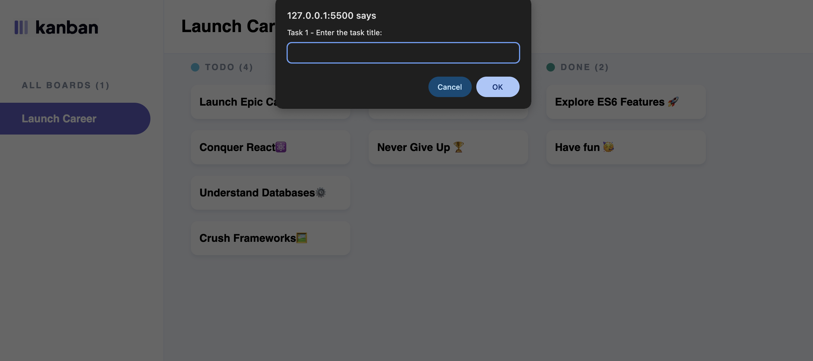

# 📝 Kanban Task Board

A simple interactive Kanban board built using HTML, CSS, and JavaScript. This board allows users to add tasks dynamically by entering task details through prompts. Tasks are organized into three columns: **TODO**, **DOING**, and **DONE**.

## 🚀 Features

- Users are prompted to enter:
  - Task Title
  - Task Description
  - Task Status (`todo`, `doing`, or `done`)
- Status input is case-insensitive and validated.
- Tasks are automatically displayed under the appropriate column.
- The task count per column is automatically updated.
- If no tasks are marked as `done`, a motivational message is logged:  
  _"No tasks completed, let's get to work!"_

## 📁 Folder Structure

project-root/
├── index.html # Main HTML file
├── styles.css # Styling for the board
├── script.js # JavaScript logic for prompts and DOM updates
└── assets/
└── logo-light.svg # Logo image
└── kanban.png # Screenshot for README

## ✅ Valid Status Options

When prompted, you can only enter:
- `todo`
- `doing`
- `done`

These can be typed in **any case** (e.g., `TODO`, `Done`, `Doing`).

## 🧪 How to Run

1. Clone or download the repo.
2. Open `index.html` in a browser.
3. When prompted, enter details for two tasks.
4. Watch them appear in the corresponding column!
5. Open your browser’s console (`F12`) to view full task details.

## 📸 Screenshots

## 🧑‍💻 Author

Created by Ayabonga Mtsotso.

---